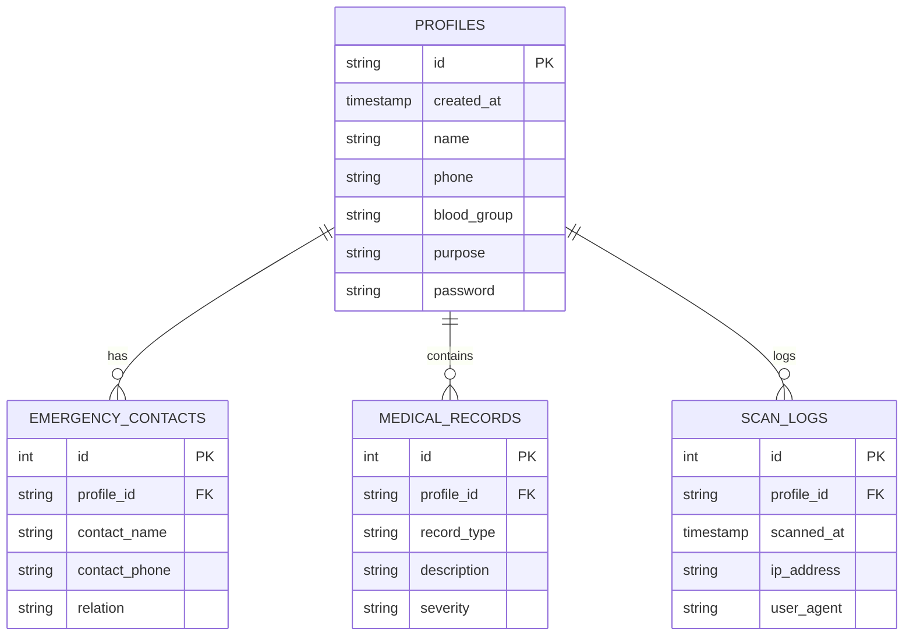

# Scan-To-Save: Enterprise Emergency Response & Analytics Platform

**Scan-To-Save** is a high-performance, data-driven emergency response solution designed to bridge the critical information gap during medical emergencies and accidents. By leveraging QR/NFC technology combined with a **Relational Analytics Architecture**, the platform provides instant access to life-saving data while enabling organizations to track emergency trends through advanced Business Intelligence.

---

## 🚀 **Core Architectural Excellence**

This project has been engineered to demonstrate professional data engineering and technology solution standards, specifically focusing on the intersection of healthcare data and actionable analytics.

### **1. Relational Data Normalization**
Transitioned from a flat database to a fully **Normalized Relational Schema** (SQLite). This ensures high data integrity and efficient querying—key requirements for enterprise-level applications.
- **Entity Integrity:** Dedicated tables for `Profiles`, `Emergency_Contacts`, `Medical_Records`, and `Audit_Logs`.
- **Data Consistency:** One-to-many relationships ensure efficient data storage and easy scalability for multi-patient management.
- **Schema Design:** Optimized for JOIN operations to reconstruct patient profiles dynamically while maintaining a small storage footprint.

### **2. Predictive Risk Modeling (Heuristic Algorithm)**
Implemented a **Patient Vulnerability Scoring Model** that performs real-time risk assessment during profile generation. This goes beyond simple data storage by adding an intelligence layer to the application.
- **Features:** 
    - **Use Case:** (e.g., A "Motorcycle Helmet" user has a higher baseline trauma risk than a "General ID" user).
    - **Medical Complexity:** Counts the number of `medical_conditions` and `medications` the user has listed.
    - **Severe Allergies:** Uses keyword matching to detect high-risk allergies (e.g., 'penicillin', 'peanuts', 'latex').
    - **Safety Net:** Penalizes scores if critical emergency contact information is missing.
- **Output:** Categorizes patients into **High, Medium, or Low Risk**, providing responders with immediate triage indicators via a dynamic visual badge.

### **3. Business Intelligence (BI) Dashboard**
Integrated a comprehensive **Admin Analytics Suite** using Chart.js to transform raw database logs into actionable insights.
- **Trend Analysis:** Real-time visualization of Use Case distributions (e.g., identifying if the platform is growing in the pet-safety or vehicle-safety sector).
- **Risk Stratification:** Statistical breakdown of the entire user base by predicted risk level, allowing for high-level population health management.
- **Audit Visualization:** Tracks the velocity of "Emergency Scans" over time to identify peak incident periods.

### **4. Security & Compliance Strategy**
- **Audit Logging:** Implemented a robust audit trail for every QR scan, tracking IP addresses, timestamps, and device agents to ensure accountability.
- **Password Protection:** Multi-tier authentication for profile editing and administrative access.
- **Consent Architecture:** Integrated explicit user consent for medical data storage, aligning with global data privacy principles (GDPR/HIPAA awareness).

---

## 📊 **Database Architecture**



---

## 🛠️ **Technology Stack**

- **Backend:** Flask (Python) with Relational SQLite
- **Frontend:** Vanilla JS, TailwindCSS, Chart.js
- **Data Engine:** SQL-driven aggregations and heuristic scoring models
- **Hardware Integration:** Dynamic QR Code generation and NFC Tag compatibility

---

## 📂 **Project Structure**

```plaintext
Scan-To-Save/
├── backend/
│   ├── app.py          # Central API, Predictive Scoring, & Routing
│   ├── database.py     # Relational Schema Design & DB Initialization
│   └── requirements.txt # Dependency Manifest
├── frontend/
│   ├── index.html      # Enterprise Landing Page & Features
│   ├── admin.html      # BI Dashboard with Chart.js Integration
│   ├── admin_login.html # Secure Administrative Access
│   ├── profile_view.html # Dynamic Profile Display with Risk Badging
│   ├── profile_form.html # Data Entry with Privacy Consent
│   ├── edit_profile.html # Secure Record Management
│   └── style.css       # Unified Professional Design System
└── README.md           # Technical Specification
```

---

## 🔮 **Future Roadmap (Scalability Strategy)**

As a solution designed for the ZS BTSA role, the future roadmap focuses on high-scale data engineering:
- **Cloud Migration:** Transitioning from local SQLite to **PostgreSQL on AWS/Azure** for high availability and concurrent user support.
- **Geospatial Analytics:** Integrating GPS data during scans to provide heatmaps of accident-prone areas to city planners.
- **Deep Learning:** Replacing the heuristic scoring model with a **Random Forest or Neural Network** as the dataset grows to improve risk prediction accuracy.
- **API Integration:** Building secure webhooks for direct integration with hospital Electronic Health Records (EHR).

---

## 📞 **Contact & Professional Alignment**

Designed and developed by **Parshuram02**. This project serves as a demonstration of technical proficiency in **Business Technology Solutions**, **Data Analytics**, and **Full-Stack Engineering**.

- **Email:** [prashant24816gp@gmail.com](mailto:prashant24816gp@gmail.com)
- **GitHub:** [Parshuram02](https://github.com/Parshuram02)
- **Role Alignment:** This project is specifically designed to showcase the skills required for a **Business Technology Solutions Associate (BTSA)**, including data strategy, analytics, and user-centric solution design.
